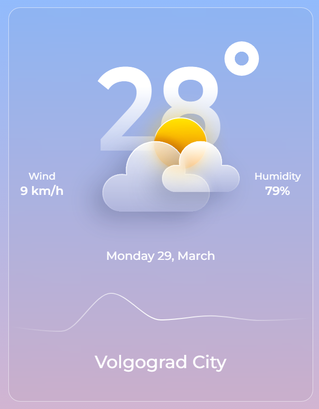
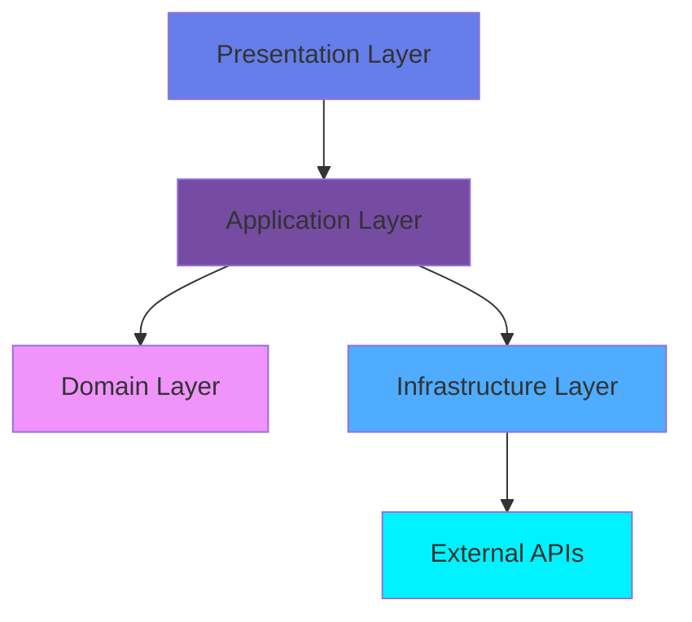

<div align="center">

# ☁️ Cloudy Weather

### *Погодное приложение нового поколения с потрясающим дизайном*

[](https://nextjs.org/)
[](https://reactjs.org/)
[](https://www.typescriptlang.org/)
[](https://tailwindcss.com/)
[](LICENSE)

<p align="center">
  
</p>

**[Live Demo](#) • [Документация](#) • [Report Bug](#) • [Request Feature](#)**

---

</div>

## ✨ О проекте

**Cloudy** — это не просто приложение для просмотра погоды. Это произведение искусства, созданное с использованием передовых веб-технологий и лучших практик разработки. Приложение демонстрирует современный подход к созданию UI с использованием **Glassmorphism**, плавных градиентов и микроанимаций.

### 🎯 Что делает этот проект особенным?

```
🏗️  Clean Architecture      →  Масштабируемая и тестируемая архитектура
💉  Dependency Injection     →  Слабая связность компонентов
🎨  Glassmorphism Design     →  Стеклянные эффекты и размытие
📊  Real-time Charts         →  Интерактивные графики погоды
⚡  Turbopack Build          →  Молниеносная сборка проекта
🎭  Gradient Magic           →  Плавные переходы и градиенты
```

---

## 🎬 Демонстрация

<div align="center">

### 🌤️ Главный экран с погодой

<!--
TODO: Добавьте сюда скриншот или GIF вашего приложения
Рекомендую использовать:
- https://www.screentogif.com/ для создания GIF
- https://gifcap.dev/ для записи экрана
-->



*Разместите здесь скриншот вашего приложения после `npm run dev`*

</div>

---

## 🚀 Ключевые возможности

<table>
<tr>
<td width="50%">

### 🎨 **Дизайн**
- ✅ Glassmorphism эффекты
- ✅ Плавные градиенты
- ✅ Адаптивная верстка
- ✅ Современная типографика (Montserrat)
- ✅ CSS модули + Tailwind CSS 4

</td>
<td width="50%">

### ⚙️ **Технологии**
- ✅ Next.js 15 с App Router
- ✅ React 19 с новейшими фичами
- ✅ TypeScript для типобезопасности
- ✅ Redux Toolkit для состояния
- ✅ Turbopack для сборки

</td>
</tr>
<tr>
<td width="50%">

### 📊 **Функционал**
- ✅ Текущая погода
- ✅ График температуры
- ✅ Скорость ветра
- ✅ Влажность воздуха
- ✅ Информация о городе

</td>
<td width="50%">

### 🏗️ **Архитектура**
- ✅ Clean Architecture принципы
- ✅ Dependency Injection (TSyringe)
- ✅ Разделение слоев (Domain, Application, Infrastructure)
- ✅ SOLID принципы
- ✅ Масштабируемость

</td>
</tr>
</table>

---

## 🛠️ Технологический стек

<div align="center">

| Категория | Технологии |
|-----------|------------|
| **Frontend** |    |
| **Styling** |   |
| **State Management** |  |
| **Charts** |  |
| **DI Container** |  |
| **Build Tool** |  |
| **Code Quality** |  |

</div>

---

## 🏛️ Архитектура проекта

Проект построен на принципах **Clean Architecture**, что обеспечивает:



### 📁 Структура проекта

```
cloudy/
├── 📱 app/                          # Next.js App Router
│   ├── _components/                 # Презентационный слой
│   │   ├── api/                     # API интеграции
│   │   ├── hooks/                   # React хуки
│   │   ├── icons/                   # Компоненты иконок
│   │   │   └── SunnyCloud/          # Иконка погоды
│   │   ├── store/                   # Redux store
│   │   └── ui/                      # UI компоненты
│   │       ├── container/           # Контейнер-компонент
│   │       ├── glass-background/    # Glassmorphism фон
│   │       ├── overview/            # Главный виджет погоды
│   │       ├── text/                # Текстовый компонент
│   │       ├── title/               # Заголовок
│   │       ├── weather-label/       # Лейбл погоды
│   │       └── weather-widget/      # Виджет погоды
│   ├── layout.tsx                   # Корневой layout
│   ├── page.tsx                     # Главная страница
│   └── globals.css                  # Глобальные стили
│
├── 🎯 src/                          # Clean Architecture слои
│   ├── application/                 # Application Layer (Use Cases)
│   ├── entities/                    # Domain Layer (Business Logic)
│   ├── infrastructure/              # Infrastructure Layer (External)
│   └── interface-adapters/          # Adapters (Mappers, Repositories)
│
├── 💉 di/                           # Dependency Injection
│   ├── container.ts                 # DI контейнер
│   └── modules/                     # DI модули
│
├── 📦 public/                       # Статические файлы
├── next.config.ts                   # Next.js конфигурация
├── tailwind.config.ts               # Tailwind конфигурация
└── tsconfig.json                    # TypeScript конфигурация
```

### 🎨 Clean Architecture Layers

<table>
<tr>
<th>Слой</th>
<th>Описание</th>
<th>Зависимости</th>
</tr>
<tr>
<td><code>entities/</code></td>
<td>Доменная логика, бизнес-правила</td>
<td>Нет зависимостей</td>
</tr>
<tr>
<td><code>application/</code></td>
<td>Use Cases, бизнес-операции</td>
<td>→ entities</td>
</tr>
<tr>
<td><code>interface-adapters/</code></td>
<td>Адаптеры, маппинг данных</td>
<td>→ application, entities</td>
</tr>
<tr>
<td><code>infrastructure/</code></td>
<td>Внешние сервисы, API</td>
<td>→ interface-adapters</td>
</tr>
<tr>
<td><code>app/</code></td>
<td>UI компоненты, презентация</td>
<td>→ application</td>
</tr>
</table>

---

## 🚀 Быстрый старт

### Предварительные требования

Убедитесь, что у вас установлено:

- **Node.js** 20.x или выше
- **npm** / **yarn** / **pnpm** / **bun**

### Установка

1️⃣ **Клонируйте репозиторий**

```bash
git clone https://github.com/your-username/cloudy.git
cd cloudy
```

2️⃣ **Установите зависимости**

```bash
npm install
# или
yarn install
# или
pnpm install
# или
bun install
```

3️⃣ **Запустите dev-сервер**

```bash
npm run dev
```

4️⃣ **Откройте браузер**

Перейдите на [http://localhost:3000](http://localhost:3000) 🎉

---

## 💻 Доступные команды

| Команда | Описание |
|---------|----------|
| `npm run dev` | Запуск dev-сервера с Turbopack |
| `npm run build` | Сборка production версии с Turbopack |
| `npm run start` | Запуск production сервера |
| `npm run lint` | Проверка кода с ESLint |

---

## 🎨 Стилистика и дизайн

### Glassmorphism эффект

Проект использует современный Glassmorphism дизайн:

```css
/* Пример стеклянного эффекта */
.glass {
  background: rgba(255, 255, 255, 0.1);
  backdrop-filter: blur(10px);
  border: 1px solid rgba(255, 255, 255, 0.2);
  border-radius: 20px;
  box-shadow: 0 8px 32px 0 rgba(31, 38, 135, 0.37);
}
```

### Градиенты

Использование `react-text-gradients` для создания плавных цветовых переходов:

```tsx
<LinearGradient
  gradient={['to bottom', 'var(--color-white) 35%, rgba(255, 255, 255, 0)']}
>
  28°
</LinearGradient>
```

---

## 🧪 Тестирование

```bash
# TODO: Добавить тестирование
npm run test        # Запуск тестов
npm run test:watch  # Режим отслеживания
npm run test:coverage  # Покрытие кода
```

---

## 📊 Производительность

| Метрика | Значение |
|---------|----------|
| ⚡ **Turbopack Build** | ~80% быстрее Webpack |
| 📦 **Bundle Size** | Оптимизирован |
| 🎨 **First Contentful Paint** | < 1s |
| ⚙️ **Time to Interactive** | < 2s |

---

## 🤝 Контрибьюция

Вклад в проект приветствуется! Вот как вы можете помочь:

1. 🍴 Форкните проект
2. 🌿 Создайте ветку для фичи (`git checkout -b feature/AmazingFeature`)
3. 💾 Закоммитьте изменения (`git commit -m 'Add some AmazingFeature'`)
4. 📤 Запушьте в ветку (`git push origin feature/AmazingFeature`)
5. 🔥 Откройте Pull Request

### Правила коммитов

Используйте [Conventional Commits](https://www.conventionalcommits.org/):

```
feat: добавить новую функцию
fix: исправить баг
docs: обновить документацию
style: изменения в стилях
refactor: рефакторинг кода
test: добавить тесты
chore: обновить зависимости
```

---

## 📝 Roadmap

- [x] ✅ Базовая структура проекта
- [x] ✅ Glassmorphism дизайн
- [x] ✅ Интеграция графиков
- [x] ✅ Clean Architecture
- [ ] 🚧 Интеграция с реальным Weather API
- [ ] 🚧 Добавить больше городов
- [ ] 🚧 Темная/светлая тема
- [ ] 🚧 Мобильное приложение (React Native)
- [ ] 🚧 Покрытие тестами > 80%
- [ ] 🚧 i18n (мультиязычность)
- [ ] 🚧 PWA поддержка

---

## 🌟 Особенности кода

### Dependency Injection

```typescript
// di/container.ts
import { container } from 'tsyringe';

// Регистрация зависимостей
container.register('WeatherService', {
  useClass: WeatherServiceImpl
});
```

### Использование TypeScript

```typescript
// Строгая типизация
interface WeatherData {
  temperature: number;
  humidity: number;
  windSpeed: number;
  location: string;
}
```

### CSS Modules

```tsx
import styles from './Overview.module.css';

<div className={styles.container}>...</div>
```

---

## 📚 Полезные ресурсы

- 📖 [Next.js Documentation](https://nextjs.org/docs)
- ⚛️ [React 19 Features](https://react.dev/blog/2024/12/05/react-19)
- 🎨 [Tailwind CSS](https://tailwindcss.com/docs)
- 📊 [Recharts](https://recharts.org/en-US/)
- 🏗️ [Clean Architecture](https://blog.cleancoder.com/uncle-bob/2012/08/13/the-clean-architecture.html)

---

## 👨‍💻 Автор

**Your Name**

- 🌐 Website: [yourwebsite.com](#)
- 💼 LinkedIn: [your-linkedin](#)
- 🐙 GitHub: [@your-github](#)
- 📧 Email: your.email@example.com

---

## 📄 Лицензия

Этот проект распространяется под лицензией **MIT**. Подробнее в файле [LICENSE](LICENSE).

---

## 💖 Благодарности

Спасибо всем, кто вдохновил на создание этого проекта:

- 🎨 [Glassmorphism Design](https://glassmorphism.com/)
- ⚡ [Vercel Team](https://vercel.com/) за Next.js и Turbopack
- 🌈 [Tailwind Labs](https://tailwindcss.com/) за Tailwind CSS
- 📚 [Clean Architecture](https://blog.cleancoder.com/) by Uncle Bob

---

<div align="center">

### ⭐ Если проект понравился — поставьте звезду!

**Сделано с ❤️ и ☕**

[](https://github.com/your-username/cloudy)
[](https://github.com/your-username/cloudy/fork)
[](https://github.com/your-username/cloudy)

---

*Создано в 2025 году*

</div>
